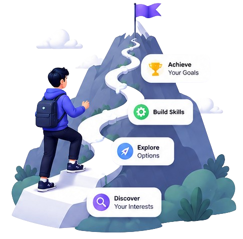

<div align="center">


# 🚀 Stop Searching. Start Learning.

### Helping students overcome **Resource FOMO** by spending less time searching and more time learning.

</div>

---

# 📖 About

Students often spend hours comparing YouTube playlists, blogs, Reddit discussions, and AI recommendations before they even begin learning.

Our platform helps students discover the right learning resources through personalized recommendations based on their goals, experience level, and learning preferences.

Instead of spending hours comparing countless tutorials, learners can confidently start with resources tailored to them.

---

# 🎯 Our Mission

Students shouldn't waste hours deciding **what** to learn from.

We want them to spend that time **actually learning.**

---

# 🎯 Project Goals

- 📚 Curate high-quality learning resources
- 🤖 Recommend personalized learning experiences
- 📅 Help students organize and plan their learning journey
- ⏳ Reduce time spent searching for resources
- 🚀 Help students start learning with confidence

---

# ✨ Current Features

- 🎨 Modern & Responsive UI
- 🌙 Dark Mode
- 🔐 Firebase Authentication (Login & Sign Up)
- 🏠 Landing Page
- 📄 Home, Features & How It Works Pages
- 🦶 Responsive Footer
- 🖱️ Interactive Navigation & Buttons
- 🎯 Custom Logo & Branding
- 🎨 Favicon Integration
- ⚡ Smooth Animations & Hover Effects
- 📱 Responsive Design
- 🐞 UI & Navigation Improvements
- 🏗️ Scalable Project Architecture

---

# 🚧 Repository Status

The repository currently reflects the latest **stable version** of the project.

Some redesigned interfaces, pages, and features showcased in our development updates are still under active development and will be pushed once they're complete and thoroughly tested.

---

# 📸 Project Preview

## 🏠 Landing Page

<p align="center">
  
</p>

---

# 🛠 Tech Stack

- HTML5
- CSS3
- JavaScript
- Firebase Authentication

---

# 📂 Project Structure

```text
.
├── .gitignore
├── README.md
├── Logo.png
├── Main.png
├── Resources.json
├── data.json
│
├── index.html
├── login.html
├── signup.html
├── feature.html
├── test.html
├── work.html
├── webdev.html
├── aiml.html
├── dsa.html
├── cybersecurity.html
│
├── style.css
├── script.js
├── login.js
├── signup.js
├── bot.js
├── firebase-config.js
│
├── sheriyans.png
├── aiml.png
├── dsa.png
├── cybersecurity.png
├── WebDev.png
└── fcc.png
```

---

# 🚀 Development Journey

We're building this project in public as part of the **NYC CodeQuest 2026 Hackathon** hosted by **Not Your College**.

Every discussion, redesign, bug fix, and feature implementation brings us one step closer to solving **Resource FOMO** for students worldwide.

---

# 🔗 Links

- 🌐 **Live Demo:** *Coming Soon*
- 💻 **GitHub Repository:** https://github.com/AyMi-2025/NYC_Contest

---

# 👥 Team

Built with ❤️ during **NYC CodeQuest 2026 Hackathon** by **Not Your College**.

### 👨‍💻 Sehjal Saxena — Product Lead

💻 GitHub: https://github.com/sehjalsaxena  
🔗 LinkedIn: https://linkedin.com/in/sehjalsaxena

---

### 👨‍💻 Ayan Maiti — Lead Frontend Developer

💻 GitHub: https://github.com/AyMi-2025  
🔗 LinkedIn: https://www.linkedin.com/in/ayan-maiti-am05052008

---

### 👨‍💻 Pratyush Kapoor — Team Lead

💻 GitHub: https://github.com/Crimson561  
🔗 LinkedIn: https://www.linkedin.com/in/pratyush-kapoor-9ab828412

---

### 👨‍💻 Anik Ghosh — Video Editor

💻 GitHub: https://github.com/anik-ghosh-io  
🔗 LinkedIn: https://www.linkedin.com/in/anik-ghosh-19571841b

---

# 🤝 Contributing

We appreciate feedback, ideas, and contributions.

If you'd like to support the project:

- ⭐ Star this repository
- 🐛 Report bugs or suggest improvements
- 💡 Share your ideas through Issues or Discussions

---

# 📄 License

This project is being developed for the **NYC CodeQuest 2026 Hackathon**.

Feel free to explore the code, share feedback, and follow our development journey.

---

<div align="center">

## 🌟 Stop Searching. Start Learning.

### Built with ❤️ during **NYC CodeQuest 2026 Hackathon** by **Not Your College**

⭐ **If you like what we're building, don't forget to leave a star!**

</div>
