<div align="center">

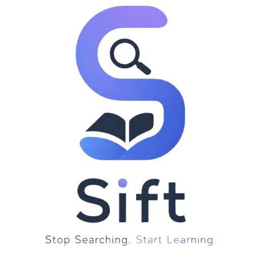

# 🔎 SIFT

### Stop Searching. Start Learning.

**SIFT cuts through Resource FOMO** — the hours students lose comparing playlists, courses, blogs, and roadmaps — and matches them to the learning resources that actually fit how they learn, why they're learning, and how much time they have.

[](#)
[](#)
[](#)
[](#)
[](#)
[](#)
[](#)

<br>

[](https://github.com/AyMi-2025/NYC_Contest/issues)
[](https://github.com/AyMi-2025/NYC_Contest/issues)
[](https://github.com/AyMi-2025/NYC_Contest)

</div>

<br>

<div align="center">

| 🎯 15 | 📚 124 | 🌐 2 | ❓ 7 |
|:---:|:---:|:---:|:---:|
| **Skills Covered** | **Curated Resources** | **Languages Supported** | **Questions to Match You** |

</div>

---

## 📑 Table of Contents

- [The Problem: Resource FOMO](#-the-problem-resource-fomo)
- [The Solution](#-the-solution)
- [Features](#-features)
- [SIFT vs. Traditional Search](#-sift-vs-traditional-search)
- [How It Works](#️-how-it-works)
- [The Recommendation Engine](#-the-recommendation-engine)
- [Architecture](#️-architecture)
- [Screenshots](#-screenshots)
- [Tech Stack](#️-tech-stack)
- [Project Structure](#-project-structure)
- [Installation](#-installation)
- [Firebase Setup](#-firebase-setup)
- [Running Locally](#-running-locally)
- [Data Model](#️-data-model)
- [FAQ](#-frequently-asked-questions)
- [Roadmap](#-roadmap--future-scope)
- [Contributors](#-contributors)

---

## 🧭 In One Line

> **SIFT asks seven short questions, then gives you your Top 3 learning resources with a confidence score and a clear reason why — no more tabs, no more comparing, no more Resource FOMO.**

---

## 😩 The Problem: Resource FOMO

Before a student writes a single line of code, they've already lost an hour to a different kind of struggle:

- Which YouTube playlist is actually good?
- Which course is worth the time?
- Which documentation is beginner-friendly?
- Which roadmap should I trust?
- What does everyone on Reddit actually recommend?

This isn't learning. It's **research paralysis** — and it happens *before* the learning even starts. We call it **Resource FOMO**: the fear that whatever you pick, something better exists that you haven't found yet.

The tragedy is that the answer is almost always the same for people in the same situation — a beginner in Web Development with 2 hours a week, a "College Learning" goal, and a preference for Hindi doesn't need to sift through 40 options. They need **one clearly-best one, and two solid backups.**

---

## 💡 The Solution

SIFT replaces the search with a conversation.

Students answer a 7-step questionnaire covering their **skill, experience level, goal, learning style, preferred language, and daily study time**, plus up to two resource preferences. SIFT scores every resource in its curated database against those answers, returns the **Top 3 matches with a confidence score**, explains **why** the best one was picked, and lets you compare all three side by side.

```text
❌ Old way:  Open 12 tabs → compare → doubt yourself → repeat → give up → learn nothing
✅ SIFT way: Answer 7 questions → get your Top 3, ranked and explained → start learning
```

## ✨ Features

<table>
<tr>
<td width="50%" valign="top">

**🔐 Accounts & Access**
- Firebase Authentication (Email & Password)
- Signup / Login with friendly error handling
- Session persistence across refreshes
- Protected routes (Dashboard, Questionnaire)
- Shared auth-guard logic across every page

**🧠 Smart 7-Step Questionnaire**
- Skill to learn (15 options)
- Experience level
- Primary goal
- Learning style
- Preferred language (English / Hindi / Both)
- Daily study time
- Up to two resource preferences
- Animated progress bar + loading sequence
- Pre-fills your previous answers on retake

</td>
<td width="50%" valign="top">

**🎯 Recommendation Engine**
- Weighted scoring across 6 factors
- Curated resource database (`resources.json`)
- Returns your **Top 3**, not just one
- "Stop Searching Score" confidence rating
- **Why This Resource?** — transparent, criterion-by-criterion explanation
- **Compare Your Top 3** — full side-by-side table

**📊 Dashboard**
- Learning Profile & Preferences at a glance
- **Your Journey** — live onboarding timeline, including a "Start Learning" step that completes the moment you click a recommended resource
- Account Information
- Quick Actions (Retake Questionnaire, Update Profile, Settings, Logout)

</td>
</tr>
</table>

Also included: a full **Features page**, **Why SIFT page**, **How It Works page**, a **Profile page** for managing your name and viewing account details, a responsive layout, full dark/light theming, and smooth animations throughout — SIFT is designed to feel like a product, not a prototype.

---

## ⚙️ How It Works

```text
   Visitor
      │
      ▼
  Landing Page
      │
      ▼
 Login / Signup
      │
      ▼
  Questionnaire  ──────▶  (Retake anytime from the Dashboard —
      │                    your previous answers are pre-filled)
      ▼
Recommendation Engine
      │
      ▼
    Dashboard
      │
      ▼
"Why This Resource?" + "Compare Your Top 3"
      │
      ▼
 Click a resource → "Start Learning" marked complete
```

Every step exists for one reason: to get the student from "I don't know where to start" to "I'm learning" as fast as possible — and to make sure they trust the recommendation once they get there.

---

## 🎯 The Recommendation Engine

This is the core of SIFT. Once a student submits the questionnaire, the engine:

1. Loads the curated resource database (`resources.json`)
2. Scores **every resource** against the student's 7 answers using a weighted rubric
3. Sorts by score and returns the **Top 3**
4. Saves the results — along with a **confidence score** — to the student's profile
5. Renders an explanation and a full comparison table on the Dashboard

### Scoring Weights

| Factor | Weight | Why |
|---|---|---|
| **Skill Match** | 40% | The single non-negotiable filter — a great resource for the wrong skill is still wrong |
| **Experience Level** | 20% | A beginner resource for an advanced learner (or vice versa) fails almost as badly |
| **Goal** | 15% | Whether the resource is genuinely suited to *why* you're learning |
| **Learning Style** | 10% | Video, reading, project-based, hands-on, or mixed |
| **Preferred Language** | 10% | English, Hindi, or resources tagged for both |
| **Daily Study Time** | 5% | A soft fit signal — nice to match, not disqualifying |

> 💬 The goal isn't to give students *more* options. It's to give them a ranked, explained shortlist so the decision is already made by the time they arrive — while still showing the runner-ups, transparently, in case they disagree.

### Why This Resource?

Every recommendation comes with a plain-language breakdown of exactly which of your answers it satisfies — skill, experience, goal, learning style, and language — each marked as matched or not. Nothing is a black box.

### Compare Your Top 3

A full side-by-side table of your three recommended resources: difficulty, duration, teaching style, language, strengths, weaknesses, best-for, and a direct link — so you can make the final call yourself if you want to.

---

## 🏗️ Architecture

```text
┌────────────┐     ┌──────────────┐     ┌────────────────────┐
│  Frontend  │────▶│  Firebase    │────▶│   Authenticated     │
│ (HTML/CSS/ │     │    Auth      │     │       Session       │
│    JS)     │     └──────────────┘     └─────────┬───────────┘
└────────────┘                                    │
                                                   ▼
                                        ┌─────────────────────┐
                                        │   Questionnaire      │
                                        │  (pre-fills on       │
                                        │      retake)         │
                                        └──────────┬───────────┘
                                                   ▼
                                        ┌─────────────────────┐
                                        │ Recommendation Engine│
                                        │  (reads resources.   │
                                        │        json)         │
                                        └──────────┬───────────┘
                                                   ▼
                                        ┌─────────────────────┐
                                        │  Cloud Firestore     │
                                        │  users/{uid}          │
                                        │  — one atomic write   │
                                        │  for answers + results│
                                        └──────────┬───────────┘
                                                   ▼
                                        ┌─────────────────────┐
                                        │      Dashboard        │
                                        │  Recommendations ·    │
                                        │  Why This Resource ·  │
                                        │  Compare Top 3 ·      │
                                        │  Your Journey          │
                                        └─────────────────────┘
```

---

## 📸 Screenshots

All screenshots live in `images/` as `s1.png` through `s16.png`, in the order below — 7 of them cover the full questionnaire flow, step by step.

<div align="center">

| | |
|:---:|:---:|
| **Landing Page**<br>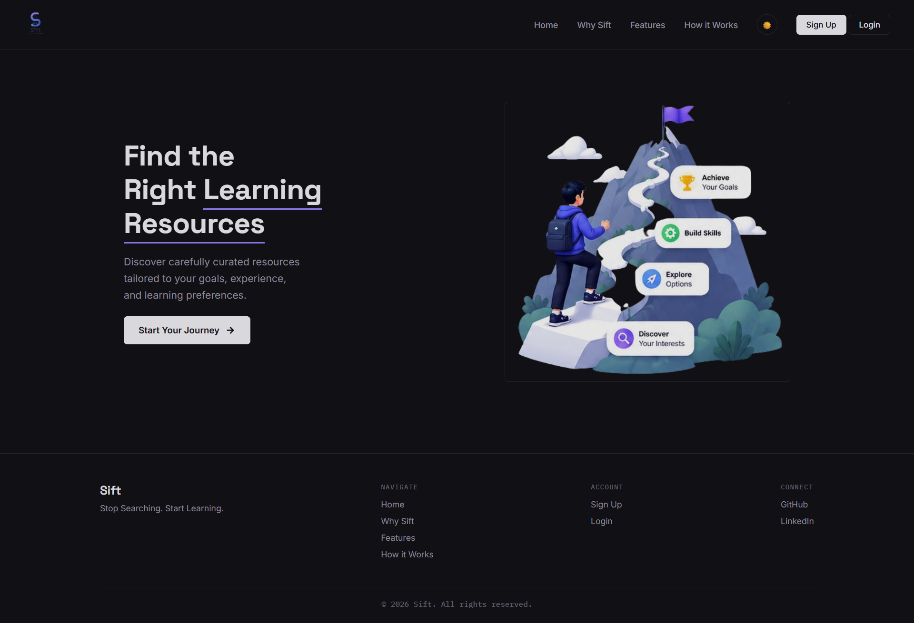 | **Why Sift**<br>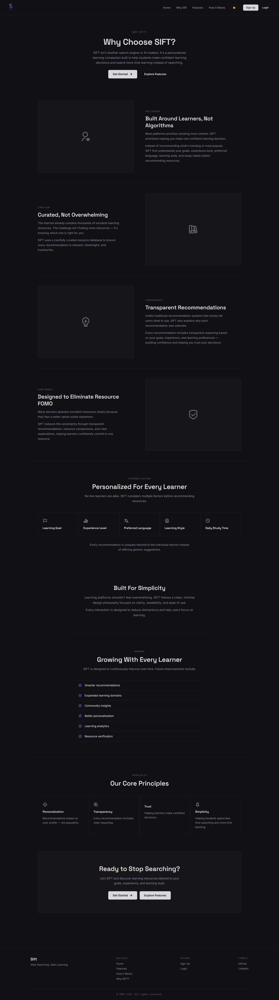 |
| **Features**<br>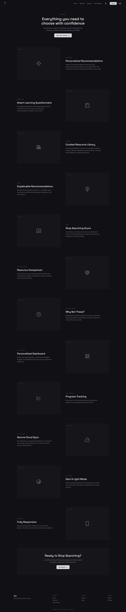 | **How It Works**<br>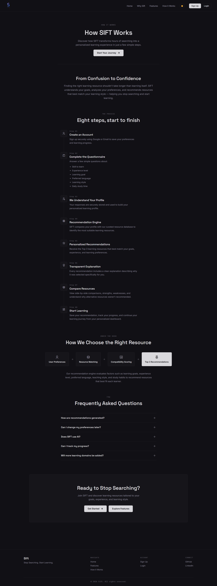 |
| **Sign Up**<br> | **Login**<br>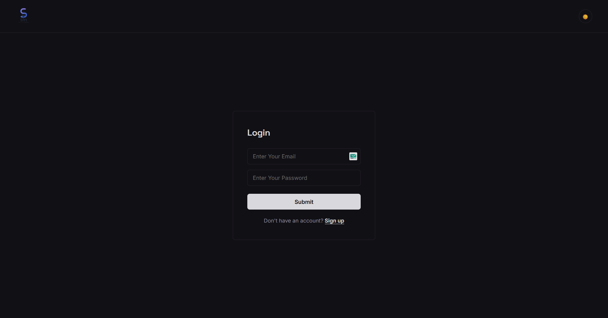 |
| **Questionnaire — Step 1: Skill**<br>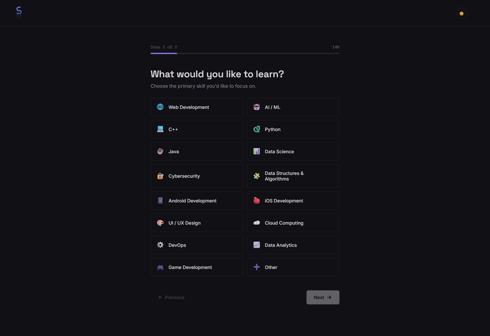 | **Questionnaire — Step 2: Experience**<br>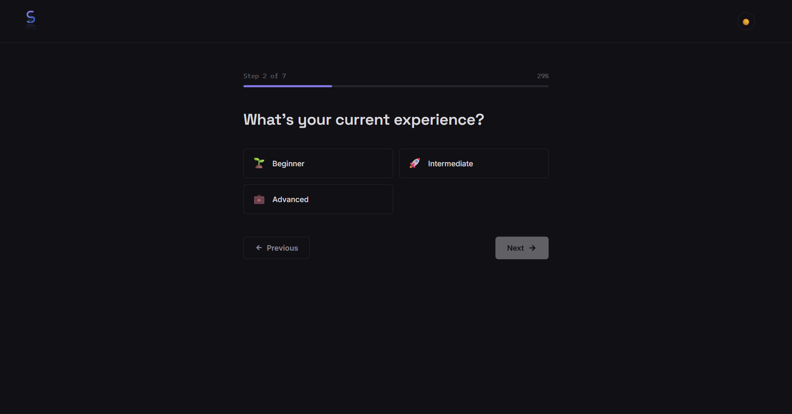 |
| **Questionnaire — Step 3: Goal**<br>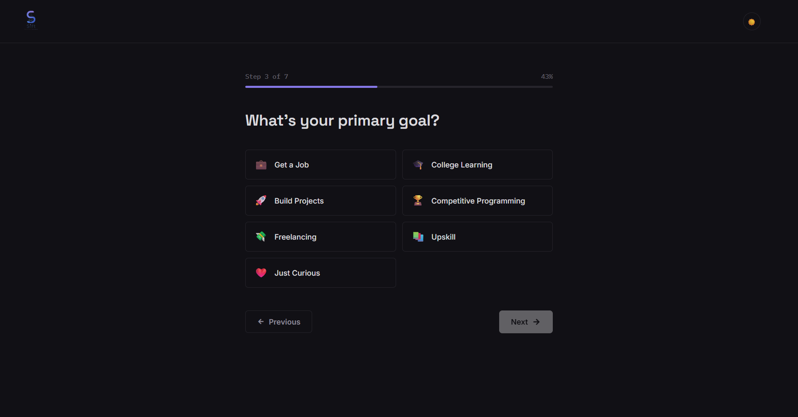 | **Questionnaire — Step 4: Learning Style**<br>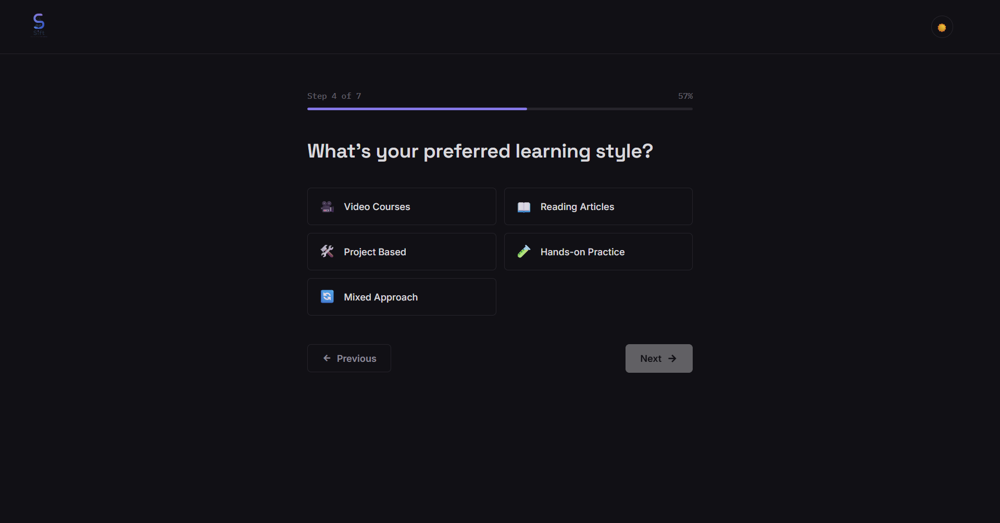 |
| **Questionnaire — Step 5: Language**<br>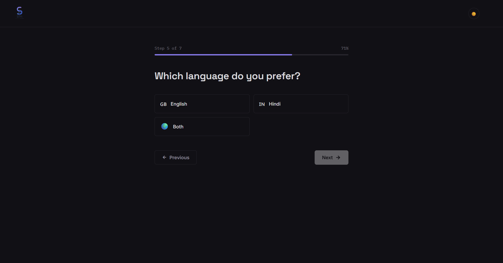 | **Questionnaire — Step 6: Study Time**<br>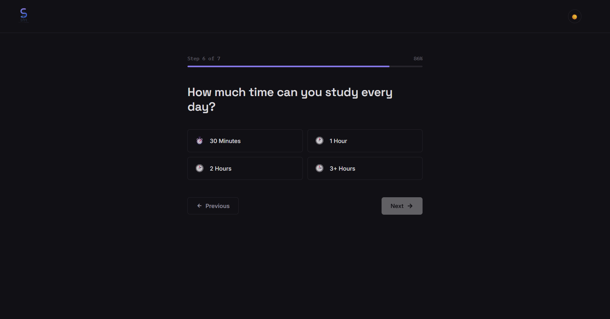 |
| **Questionnaire — Step 7: Preferences**<br>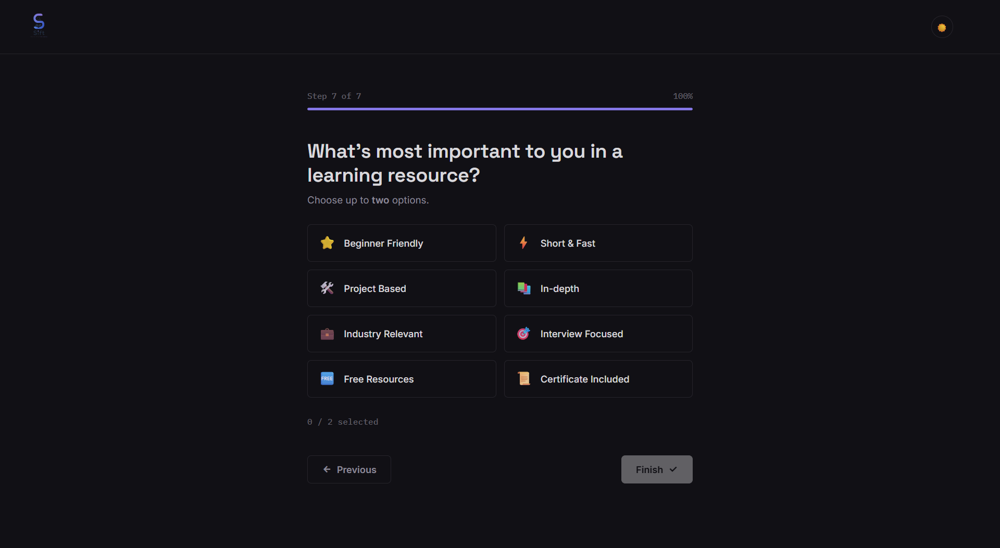 | **Dashboard**<br>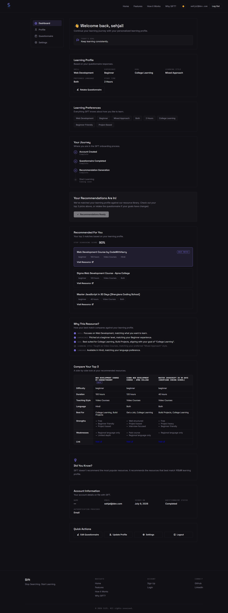 |
| **Profile**<br>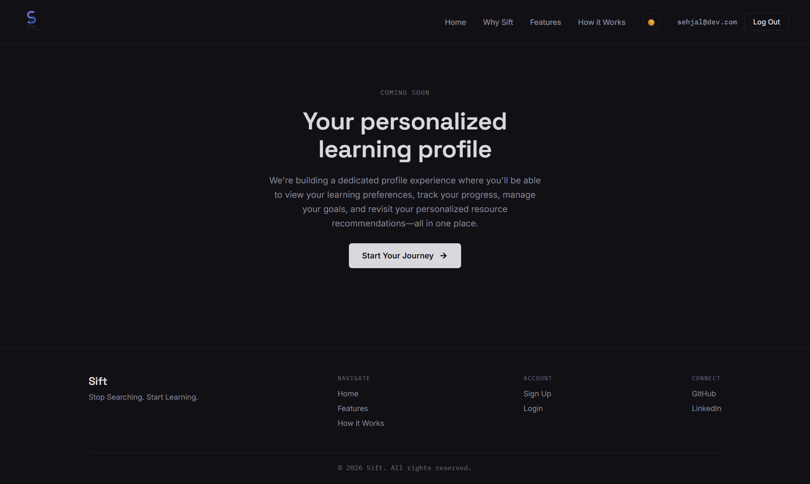 | **Settings**<br>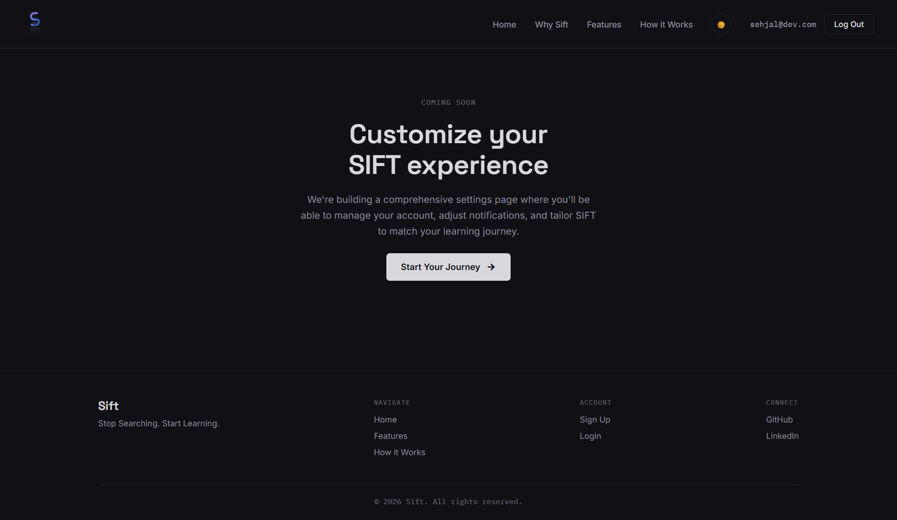 |

</div>

---

## 🛠️ Tech Stack

| Layer | Technology |
|---|---|
| **Frontend** | HTML5, CSS3, vanilla JavaScript (no framework, no build step) |
| **Authentication** | Firebase Authentication (Email & Password) |
| **User Data** | Cloud Firestore — one document per user (`users/{uid}`) |
| **Resource Database** | Static curated JSON (`resources.json`) |
| **Tooling** | Git, GitHub, VS Code |

---

## 📂 Project Structure

```text
.
├── images/
│   ├── hero-image.png
│   ├── logo.png
│   └── s1.png … s16.png
├── js/
│   ├── auth-guard.js       # Shared auth/session/routing logic
│   ├── dashboard.js
│   ├── firebase-config.js
│   ├── landing.js
│   ├── questionnaire.js    # Wizard logic + recommendation engine
│   └── work.js
├── pages/
│   ├── feature.html
│   ├── profile.html
│   ├── questionnaire.html
│   ├── settings.html
│   ├── why.html
│   └── work.html
├── .gitignore
├── README.md
├── resources.json          # Curated resource database
├── dashboard.html
├── index.html
├── login.html
├── login.js
├── script.js
├── signup.html
├── signup.js
└── style.css
```

---

## 🚀 Installation

```bash
# Clone the repository
git clone https://github.com/AyMi-2025/NYC_Contest.git

# Move into the project directory
cd NYC_Contest
```

No build step, no package manager required — SIFT runs on plain HTML, CSS, and JavaScript.

---

## 🔥 Firebase Setup

1. Create a project at [Firebase Console](https://console.firebase.google.com/)
2. Enable **Email/Password Authentication** under **Build → Authentication → Sign-in method**
3. Enable **Cloud Firestore** under **Build → Firestore Database**
4. Set Firestore security rules so each user can only read/write their own document:
   ```
   match /users/{uid} {
     allow read, write: if request.auth != null && request.auth.uid == uid;
   }
   ```
5. Copy your Firebase config object and paste it into `js/firebase-config.js`:

```javascript
const firebaseConfig = {
  apiKey: "YOUR_API_KEY",
  authDomain: "YOUR_AUTH_DOMAIN",
  projectId: "YOUR_PROJECT_ID",
  storageBucket: "YOUR_STORAGE_BUCKET",
  messagingSenderId: "YOUR_SENDER_ID",
  appId: "YOUR_APP_ID"
};
```

---

## 💻 Running Locally

```bash
# Option 1 — open directly
open index.html

# Option 2 — serve locally (recommended for Firebase auth to work correctly)
npx serve .
```

Then visit `http://localhost:3000` (or whichever port your server assigns).

---

## 🗄️ Data Model

Every signed-in user has exactly one document at `users/{uid}` in Firestore:

```text
users/{uid}
├── questionnaire            (map: skill, experience, goal, learningStyle,
│                              language, studyTime, preferences[])
├── questionnaireCompleted   (boolean)
├── bestResource             (object — top-ranked resource)
├── topResources             (array — Top 3 resources)
├── confidenceScore          (number — the "Stop Searching Score")
├── progress                 (number)
├── startedLearning          (boolean — set true on first resource click)
└── name                     (string — set from the Profile page)
```

Questionnaire answers and recommendation results are always written together in a single atomic call, so the two can never drift out of sync.

---

## 🔭 Roadmap & Future Scope

SIFT is just getting started. Here's where it's headed:

- [ ] Study Planner
- [ ] Smart Learning Roadmaps
- [ ] Deeper Progress Analytics (beyond "started learning")
- [ ] Community Features
- [ ] Gamification
- [ ] Notes
- [ ] Bookmarks
- [ ] Real Settings page (currently a placeholder)
- [ ] 📱 **Mobile App** — SIFT in your pocket, for on-the-go recommendations
- [ ] 🧩 **Browser Extension** — get recommendations without leaving the site you're already on
- [ ] 🌍 **Expanded Resource Categories & Database** — deeper coverage across all 15 skills and both languages

---

## 👥 Contributors

<table>
<tr>
<td align="center" width="25%">
<b>Pratyush Kapoor</b><br/>
<sub>Team Lead</sub><br/><br/>
Team Coordination • Project Management<br/>
Feature Planning • Overall Development Support<br/>
Sprint Planning • Task Delegation<br/>
Team Communication<br/><br/>
<a href="https://github.com/Crimson561">GitHub</a> · <a href="https://www.linkedin.com/in/pratyush-kapoor-9ab828412">LinkedIn</a>
</td>
<td align="center" width="25%">
<b>Sehjal Saxena</b><br/>
<sub>Product Lead</sub><br/><br/>
Product Vision & Strategy • UI/UX Planning<br/>
Recommendation Engine • Curated Database<br/>
Feature Planning • Documentation & Social Media<br/>
Project Management<br/><br/>
<a href="https://github.com/sehjalsaxena">GitHub</a> · <a href="https://linkedin.com/in/sehjalsaxena">LinkedIn</a>
</td>
<td align="center" width="25%">
<b>Ayan Maiti</b><br/>
<sub>Lead Frontend Developer</sub><br/><br/>
Frontend Development • UI Implementation<br/>
Responsive Design • Frontend Optimization<br/>
Component Architecture • Cross-Browser Testing<br/>
Performance Tuning<br/><br/>
<a href="https://github.com/AyMi-2025">GitHub</a> · <a href="https://www.linkedin.com/in/ayan-maiti-am05052008">LinkedIn</a>
</td>
<td align="center" width="25%">
<b>Anik Ghosh</b><br/>
<sub>Video Editor</sub><br/><br/>
Demo Video • Product Presentation<br/>
Promotional Content • Video Scripting<br/>
Social Media Clips • Thumbnail Design<br/>
Content Editing<br/><br/>
<a href="https://github.com/anik-ghosh-io">GitHub</a> · <a href="https://www.linkedin.com/in/anik-ghosh-19571841b">LinkedIn</a>
</td>
</tr>
</table>

---

## 🙏 Acknowledgements

Built during **NYC CodeQuest 2026**, hosted by **Not Your College** — thank you for the platform, the timeline, and the push to turn a shared frustration into something real.

---

## 🤝 Contributing

SIFT is still early, and we'd love your input:

- ⭐ **Star the repo** if the idea resonates with you
- 🐛 **Open an issue** for bugs or friction points
- 💡 **Start a discussion** if you have ideas for the recommendation engine or resource database

---

## 📄 License

This project was built for **NYC CodeQuest 2026**. Feel free to explore the code, fork it, and follow along as it grows.

---

<div align="center">

## 🌟 Stop Searching. Start Learning.

**SIFT** — built with ❤️ during **NYC CodeQuest 2026** by **Not Your College**

[](https://github.com/AyMi-2025/NYC_Contest)

*If SIFT saved you from Resource FOMO even once, leave us a star.* ⭐

</div>
